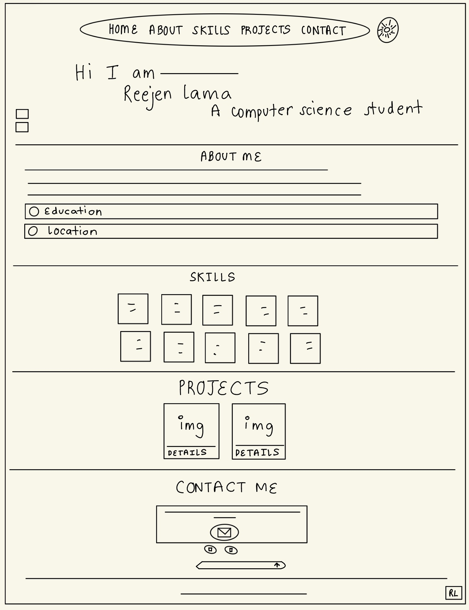

# Reejen Portfolio

### PART 1: CONTENT
 
**1. What is your full name as you want it displayed professionally?**
I want my name to be displayed as Reejen Lama.
 
**2. What is the purpose of your portfolio website?**
The purpose of this portfolio website is to showcase my skills and projects so that people can learn more about me and view my work.
 
**3. Who is the target audience (employers, clients, peers, etc.)?**
The target audience is employers and peers.
 
**4. What skills do you want to highlight?**
I want to highlight my skills in frontend development.
 
**5. What projects or work will you showcase?**
I decided to showcase two projects. The first being a 2D maze-game designed on Godot where the character has to surpass challenges and collect coins, and the second being a console-based airplane management system programmed using Java for my Object Oriented Programming class.
 
**6. How will you describe yourself in a short professional bio?**
I am a junior majoring in Computer Science at Queens College. I enjoy learning new technologies, solving programming problems, and building projects that improve my technical skills.
 
**7. What pages will your site include (Home, About, Projects, Contact, etc.)?**
The pages my site includes are Home, About, Skills, Projects, and Contact.
 
**8. What is your career goal or desired role?**
I am currently exploring different areas of Computer Science and do not have a specific role I am inclined towards. I am excited to gain experience in software development, learn from different opportunities, and contribute to projects where I can continue growing my technical skills.
 
**9. What technologies or tools do you have experience with?**
Technologies and tools that I have experience with include: HTML, CSS, JavaScript, Python, VS Code, Godot, GitHub, Java, C++, Django.
 
**10. What achievements or experiences are worth highlighting?**
My main experiences come from my coursework and personal projects. Through building applications and completing programming assignments, I have developed skills in programming, problem-solving, and software development.
 
**11. What call-to-action should visitors take (contact you, view projects, download resume)?**
Visitors should view my skills and projects and contact me for any opportunities.
 
**12. Will you include a resume? In what format?**
I didn't include my resume.
 
**13. What social or professional links will you include (GitHub, LinkedIn, etc.)?**
I have included my GitHub and email.
 
### PART 2: DESIGN
 
**1. What overall style will best represent you (minimalist, creative, professional, etc.)?**
My style is best represented as minimalist. I like using fonts and colors that are neutral and simple.
 
**2. What color scheme will you use and why?**
The color scheme I used for this website is mainly purple. The main background color used is purple, whereas the texts are a combination of darker purple, black, and white.
 
**3. What fonts will you use for headings and body text?**
I used the font Inter for headings and body text as it looked good with the overall design of the website.
 
**4. How will your design reflect your personality or field?**
The design and layout of the website reflects my personality well as it is neatly organized along with minimal design. The simple design represents my preference for structure, while the inclusion of my skills, projects, and technology focused elements reflects my interest in the field of Computer Science.
 
**5. What layout will your homepage follow?**
The homepage has a navbar which consists of Home, About, Skills, Projects, and Contact. It also has a button for light and dark mode on the right side.It follow a minimal layout which displays my name in a big font.
 
**6. How will you organize project sections visually?**
The project section has two projects included, which are confined into two boxes. Each box includes the project title along with its picture and a short description. The box describes the project shortly and the tools used for the project.
 
**7. Will the site be mobile-friendly? How will you ensure responsiveness?**
Yes, the site is mobile-friendly. I used CSS media queries to change the layout at different screen widths. I tested it by opening Chrome DevTools and dragging the screen width down to check phone and tablet sizes.
 
**8. What visual hierarchy will guide visitors?**
I used large headings, spacing, and contrasting colors that help important information stand out. I also included a navbar along with day and night mode button at the top of the screen which guides the user to click on different sections of the website.
 
**9. How will consistency be maintained across pages?**
To maintain consistency across the whole website, I used the same color schemes, fonts, and divided each sections(Skills,Projects,Contact) accordingly.
 
**10. How will accessibility be considered (contrast, font size, readability)?**
I maintained a good color contrast and chose a readable font size for the accessibility of viewers.I also included day and night mode for the user preference.
 
**11. Will you use icons, images, or illustrations? Why?**
Yes, I used icons for GitHub, email, and dark/light mode in the website. I also used images for my projects. The icons and images made the portfolio look more organized and took up less space.
 
**12. What portfolio websites inspired your design?**
I took inspiration from modern-minimal websites with clean layouts and typography.
 
### PART 3: INTERACTIVITY
 
**1. What interactive elements will your site include (navigation menus, buttons, forms)?**
The interactive elements included in my site are: navigation, buttons (dark/light mode),and contact forms.
 
**2. Will your site include a contact form? How will it work?**
Yes, my site has a contact form included. The website has a mail icon which visitors can click, opening a contact form where they can send me a message.
 
**3. What JavaScript features will you implement?**
I implemented different JavaScript features like: dark/light mode switching, mobile navigation, and smooth scrolling.
 
**4. How will users receive feedback from interactions?**
Interactive icons such as GitHub and email change their color slightly so that visitors know they are clickable. For example, when the GitHub icon is clicked, it takes the user to my GitHub account. The project box also opens right away when the user clicks on it, showing a short description of the project.
 
**5. How does interactivity improve the user experience?**
The interactivity makes the website more enjoyable and engaging to navigate through. The interactive icons and forms give feedback to the user. It also makes the website stand out.

### The external resources used (links)

- [GitHub Pages Documentation](https://docs.github.com/en/pages/getting-started-with-github-pages/creating-a-github-pages-site)
- [Google Fonts — Inter](https://fonts.google.com/specimen/Inter)
- MDN Web Docs — HTML/CSS/JavaScript reference

 ##  wireframe design

 

 ## main sections

 **1.Project overview**
 This is a personal portfolio website built to showcase my skills, education, and projects as a Computer Science student. The purpose of the site is to give visitors i.e  employers and peers an organized view of my abilites.

 **2.Target audience**
 Employers,peers and professors are the main target audience for this portfolio website.

 **3 Content strategy**
 The website is built around showcasing my skills in frontend development, along with two key projects: a 2D maze game built in Godot, where the player navigates challenges and collects coins, and a console-based airplane management system built in Java for my Object-Oriented Programming class. My technical experience are HTML, CSS, JavaScript, Python, VS Code, Godot, GitHub, Java, C++, and Django, drawn primarily from coursework and personal projects that have helped me build skills in programming and problem-solving.

 **4 Information organization**
 The information is organized by dividing the content into 5 sections:Home,About,Skills,Projects and Contact.Each section can be easily accessed through the navigation bar loacted at the top of the screen.Darker font color and bigger font size is used for the header.

**5 Visual desing (wireframe and more)**
The overall style of the website is minimal.The color scheme is mainly different shades of purple and font used throught the website is Inter.A navbar consisting on different sections is placed on top of the screen making it easier for the users to access each section.Icons are used for GitHub, email, and the dark/light mode toggle. Images are used for the two featured projects.It is a modern-minimal portfolio website with clean layout.

**6 interaction / functionality**
I have included different interactive elements like :Navigation menu, dark/light mode toggle button and contact form.The mail icon that, when clicked, opens a contact form allowing users to send me a message directly. Clicking the GitHub icon takes the user to my GitHub profile.In the project section the project boxes expand when clicked, revealing a short project description.

**7 technical overview**
This website is built using html,css and javascript.It is hosted on Github pages.

**8 timeline / project milestone**
I began by creating the project in VS Code, where I built the HTML structure for each section ,followed by the CSS styling. I then implemented the JavaScript functionality. Once the site was functional, I created a new GitHub repository and committed my files to it. After confirming everything was pushed correctly, I enabled GitHub Pages to deploy the site live. Finally, I completed the wireframe and finalized the README documentation.

